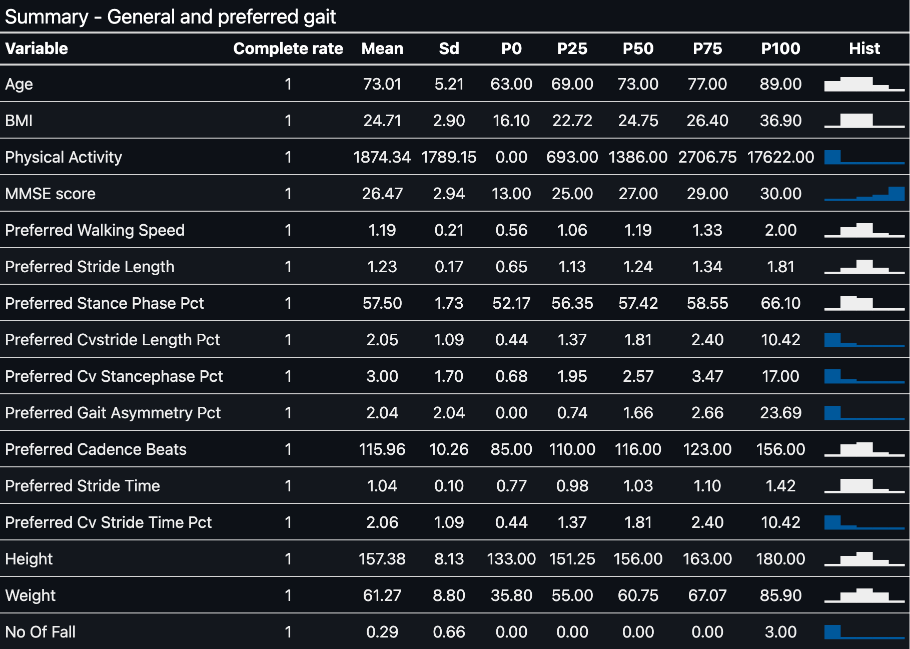

```{r setup, message=FALSE, warning=FALSE, include=FALSE}
knitr::opts_chunk$set(echo = TRUE,
                      fig.align = "center",
                      fig.height = 5,
                      fig.width = 8,
                      dpi = 320,
                      dev = "png",
                      dev.args = list(type = "cairo",
                                      bg = "transparent"))
```

```{r libs, message=FALSE, warning=FALSE, include=FALSE}

source("helper_functions.R")

used_libs <- c("tidyverse", "gt", "doParallel", "glmnet", "ranger", "readxl", "tidymodels", "skimr", "gridExtra")

# full load libs
(\(x){
  sapply(x, library, character.only=T)
})(c("tidyverse", "gt", "doParallel", "glmnet", "ranger", "tidymodels", "gridExtra", "felib"))


#save requirement txt
req_info(used_libs)


```


## Introduction

```{r data, message=FALSE, warning=FALSE, include=FALSE}

dat_path <- file.path("data")
elder_adj_path <- file.path(dat_path, "elder_adj.rds")

if(file.exists(elder_adj_path)){
  elder_adj <-  readRDS(elder_adj_path)
}else{
  elder_adj <- load_elder_dat_adj(dat_path, elder_adj_path)
}

```

Is it possible to know if an elderly has fallen in the past six months using information about his gait? We will discover this using the data from 746 elderly from @noh, published in Nature Scientific Reports (2021). The dataset contains gait information at three speeds: preferred, -20% slow, and 20% faster than the preferred speed. Furthermore, the dataset has some general info like age, body mass index (BMI), and physical activity levels of each elder.

Our target variable, History of Falls, is highly unbalanced. We will predict it using mainly information about preferred speed gait patterns. However, we will also construct and use some variables to reflect changes in gait strategy with speed. 

```{r data_balance, echo=FALSE}

plot_balance <-
  elder_adj %>% 
  ggplot(aes(History_of_fall, fill= History_of_fall)) +
  geom_bar(show.legend = FALSE)+
  ylab("Observations (n)") +
  scale_fill_manual(values = c("#615C61", "#00589B")) +
  scale_y_continuous(expand = c(0, NA),
                     limits = c(NA, NA)) +
  xlab(NULL) +
  ggtitle("History of fall") +
  plot_theme(color_scheme = "dark")

plot_balance

# ggsave(
#        "p1.png",
#        plot_balance,
#        bg = "transparent")


```

## Data split
Before exploring our data, we will split it into train and test sets to avoid data leakage during our modeling. The split will stratify the data by the target variable and allocate 80% for training and the remaining (20%) for testing our models. Taking advantage of the moment, we will also create 10-cross-validation folds with three repeats. 

```{r data_split}
set.seed(44)
elder_split <- initial_split(elder_adj, strata = History_of_fall, prop = .8)
elder_train <- training(elder_split)
elder_test <- testing(elder_split)

#cv folds
set.seed(44)
elder_folds <- vfold_cv(elder_train, v=10, repeats = 3)

```


## Looking at our data - EDA

Skimming through numeric variables about elderly general and preferred gait info, we can see that physical activity,  MMSE score, gait asymmetry, and all variables of coefficient of variation (CV) are highly skewed, and outliers can be the culprits. Therefore, we will need to act upon them.

```{r table_skim-1, echo=FALSE, warning=FALSE, out.width = '100%'}

if(!file.exists("elder_numeric_vars_table.png")){
  elder_adj %>% 
  select(where(is.numeric), 
         -Number, 
         -contains(".")) %>% 
  skimr::skim() %>%
  mutate(across(where(is.numeric), ~ round(., 2))) %>% 
  select(-c(skim_type, n_missing )) %>% 
  rename_with(~ gsub("numeric\\.|skim_", "", .) %>%  str_to_title) %>% 
  rename_with(~ gsub("_", " ", .)) %>% 
  mutate(Variable = gsub("_", " ", Variable),
         Variable = ifelse(!grepl("MMSE|BMI", Variable), str_to_title(Variable), Variable)) %>% 
  gt(id = "elder_skim1") %>% 
  tab_header("General and preferred gait description") %>%
  opt_align_table_header(align = "left") %>%
  cols_align(align = "center", columns = c(everything(), -Variable)) %>% 
  #genneral tab layout
  tab_options(heading.title.font.weight = "bold",
              column_labels.font.weight = "bold",
              table.font.color = "#EEEEEE",
              #table.font.color.light = "#222222",
              table.background.color = "#333",
              heading.background.color = "#333",
              column_labels.background.color = "#333",
              table.border.top.color = "#333",
              row.striping.include_table_body = TRUE,
              table_body.hlines.color = "#333",
              table_body.vlines.color = NULL,
              table.border.right.color = "#333",
              table.border.right.width = 3,
              table.border.left.color = "#333") %>% 
  opt_css(css= "
          #elder_skim1 .gt_table{
          background-color: #333}",
          add = TRUE, allow_duplicates = FALSE) %>% 
  #tab specific layour
  tab_style(style = list(cell_text(color = "#00589B")),
            locations = cells_body(
              columns = Hist,
              rows = grepl("activity|MMSE|CV", Variable, ignore.case = TRUE))) %>% 
  gtsave("elder_numeric_vars_table.png", vwidth = 1500, vheight = 1000)
}





```


Exploring further our data, we can make some observations:

* Faster walker elderly with long strides have fallen in the past six months. This pattern has some overlap with high BMI values;
* High levels of physical activity protect from falls, as high values of physical activity do not superimpose the fall pattern;
* At last, a moderate variation in cadence between fast and slow speeds is the strategy of an elderly who has fallen. Therefore, more conservative or riskier approaches do not identify who fell. Probably because those who take a more conservative approach are more careful, and the riskier ones are confident in their walking ability.


```{r EDA, echo=FALSE, fig.height= 10}


grid.arrange(
  grobs = list( plot_elder(stride_length, walking_speed, History_of_fall),
  plot_elder(stride_length, walking_speed, BMI) + ggtitle("BMI"),
  plot_elder(stride_length, walking_speed, physical_activity),
  plot_elder(stride_length, walking_speed, fast.slow_cadence_beats)
), ncol = 2)

               


```


```{r eval=FALSE, include=FALSE}
# info about preferred speed
pref_spd <-
  elder_adj %>% 
  select(age:MMSE_score, contains("preferred"), Heightcm:History_of_fall)
names(pref_spd) <- names(pref_spd) %>% gsub("preferred_", "", .)
pref_spd <- pref_spd %>% rename(physical_activity = total_physical_activity_MET_min_week)

elder_train %>% 
  select(where(is.numeric)) %>% 
  filter(across(everything(), ~ is.finite(.))) %>% 
  corrr::correlate() %>% 
  corrr::rearrange() %>% 
  corrr::network_plot(curved = FALSE, min_cor = .7,
                      colors = c("#FF8C55", "white", "#0F4C81"))

```


## Preparing our data - EDA


## References 

<div id="refs"></div>
