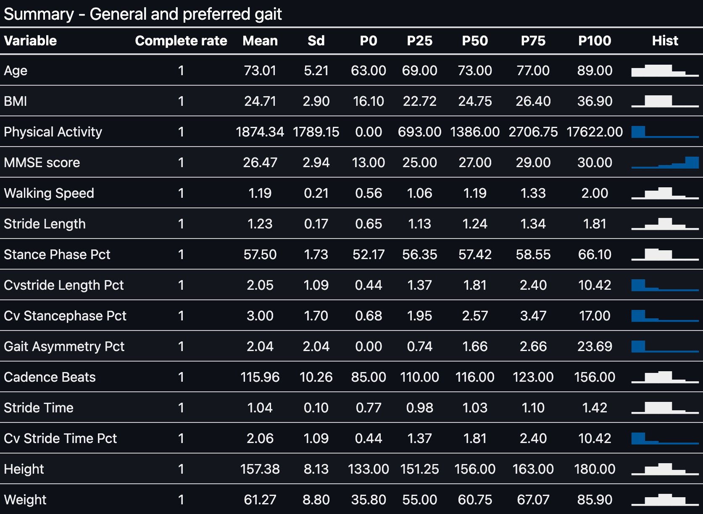
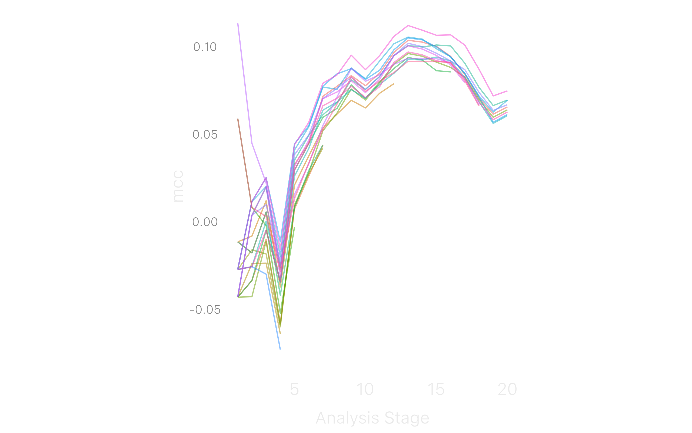
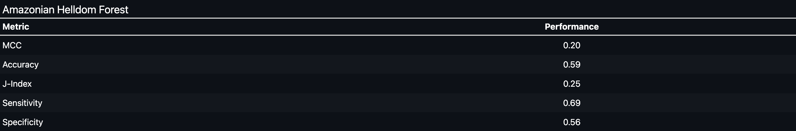
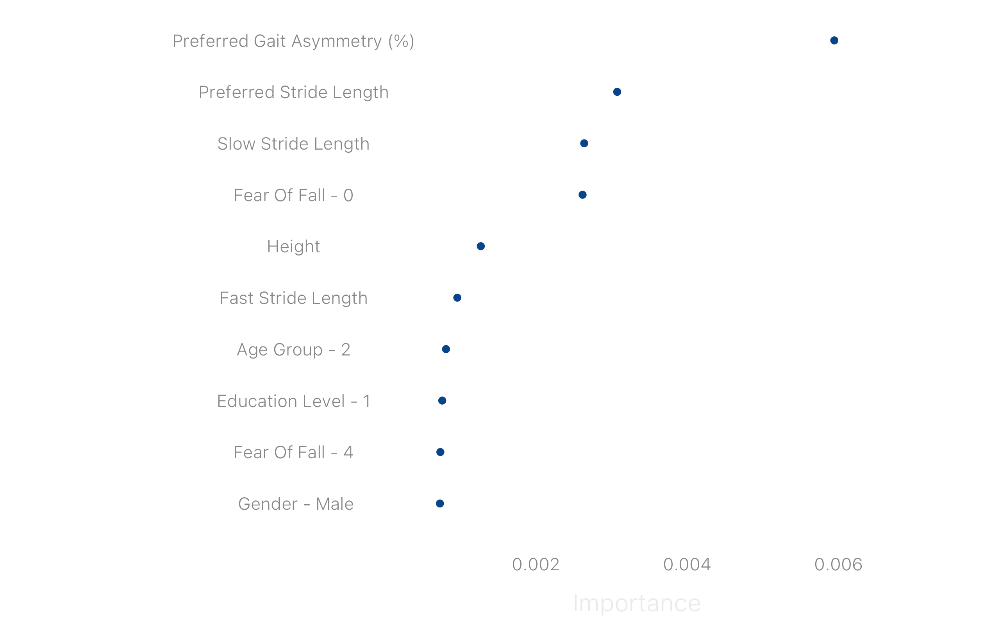

Walk the walk: Does this elder has fallen?
================
Luiz Felipe Martucci
2023-01-31

## Introduction

Is it possible to know if an elderly has fallen in the past six months
using information about his gait? We will discover this using the data
from 746 elderly from Noh et al. (2021), published in Nature Scientific
Reports (2021). The dataset contains gait information at three speeds:
preferred, -20% slow, and 20% faster than the preferred speed.
Furthermore, the dataset has some general info like age, body mass index
(BMI), and physical activity levels of each elder.

Our target variable, History of Falls, is highly unbalanced. We will
predict it using data about the three speeds to give our models
information on how gait strategy changes with speed.


## Data split

Before exploring our data, let’s split it into train and test sets to
avoid data leakage during our modeling. The split will stratify the data
by the target variable and allocate 80% for training and the remaining
(20%) for testing our models. Taking advantage of the moment, we will
also create 10-cross-validation folds with two repeats.

``` r
set.seed(44)
elder_split <- 
  elder_adj %>% 
  mutate(History_of_fall = factor(History_of_fall, levels = c("Yes", "No"))) %>% 
  initial_split(strata = History_of_fall, prop = .8)
elder_train <- training(elder_split)
elder_test <- testing(elder_split)

#cv folds
set.seed(46)
elder_folds <- vfold_cv(elder_train, v=10, repeats = 2)
```

## Looking at our data - EDA

Skimming through numeric variables about elderly general and preferred
gait info, we can see that physical activity, MMSE score, gait
asymmetry, and all variables of coefficient of variation (CV) are highly
skewed, and outliers can be the culprits. However, we will not need to
care about this now, as we will use models resilient to this.



Exploring further our data, we can make some interesting observations:

- Faster walker elderly with long strides have fallen in the past six
  months. This pattern has some overlap with high BMI values;
- High levels of physical activity protect from falls, as high values of
  physical activity do not superimpose the fall pattern.


## Feature engineering

To train our models, we need to prepare the data. As the data doesn’t
have missing values, we need only to hot-encode our categorical vars.
Additionally, we will remove all variables with zero variance and
downsample the no-fall observations.

## Models

Our first model will be the Amazonian Helldom Forest, a Random Forest,
trained with 10k small trees. We will try 20 combinations of the number
of random variables tried before splitting a node (mtry) and the minimum
samples necessary to split a node. We will race these models against
each other and compare their performance on cross-validation folds with
ANOVA. Models with significantly lower performance will be out of the
race.

As we can see in the race plot, five models survived until the last
round with similar performances. And how about the performance of the
best of these on the test set?


The performance of our model was not stellar but still better than
random chance. The most important variables for our model predictions
were:



## Conclusions

Our present results show that we can not identify with superb
performance an elderly who has fallen based on their gait pattern at
different speeds. However, the most important variable for our model,
gait asymmetry at preferred velocity, highlights two things. First, more
variables linked to gait asymmetry could improve our model predictions.
Two, **an elderly who relies more on one leg can be more prone to fall
when this leg fails upon then.**

## References

<div id="refs" class="references csl-bib-body hanging-indent">

<div id="ref-noh" class="csl-entry">

Noh, Byungjoo, Changhong Youm, Eunkyoung Goh, Myeounggon Lee, Hwayoung
Park, Hyojeong Jeon, and Oh Yoen Kim. 2021. “XGBoost Based Machine
Learning Approach to Predict the Risk of Fall in Older Adults Using Gait
Outcomes.” Journal Article. *Scientific Reports* 11 (1): 12183.
<https://doi.org/10.1038/s41598-021-91797-w>.

</div>

</div>
