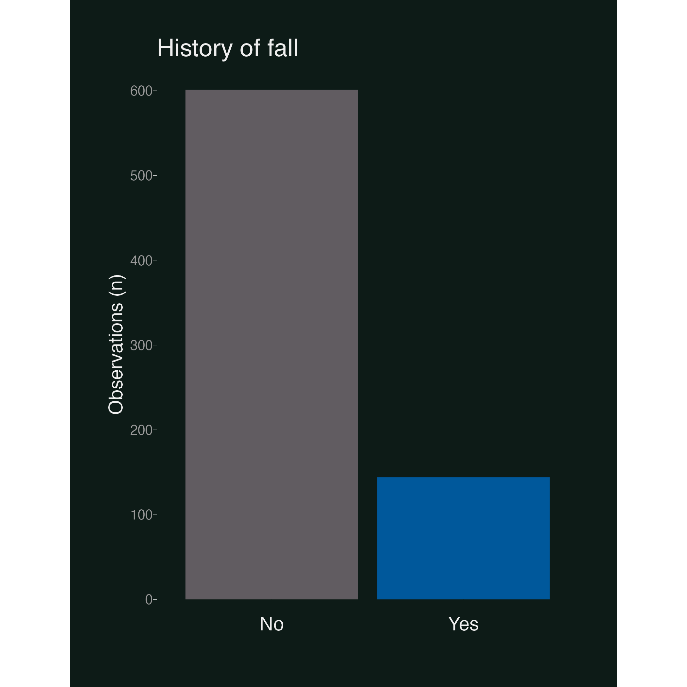

Walk the walk: Does this elder has fallen?
================
Luiz Felipe Martucci
2023-01-31

## Introduction

Is it possible to know if an elderly has fallen in the past six months
using information about his gait? We will discover this using the data
from 746 elderly from Noh et al. (2021), published in Nature Scientific
Reports (2021). The dataset contains gait information at three speeds:
preferred, -20% slow, and 20% faster than the preferred speed.
Furthermore, the dataset has some general info like age, body mass index
(BMI), and physical activity levels of each elder.

Our target variable, History of Falls, is highly unbalanced. We will
predict it using mainly information about preferred speed gait patterns.
However, we will also construct and use some variables to reflect
changes in gait strategy with speed.



## Data split

Before exploring our data, we will split it into train and test sets to
avoid data leakage during our modeling. The split will stratify the data
by the target variable and allocate 80% for training and the remaining
(20%) for testing our models. Taking advantage of the moment, we will
also create 10-cross-validation folds with three repeats.

``` r
set.seed(44)
elder_split <- initial_split(elder_adj, strata = History_of_fall, prop = .8)
elder_train <- training(elder_split)
elder_test <- testing(elder_split)

#cv folds
set.seed(44)
elder_folds <- vfold_cv(elder_train, v=10, repeats = 3)
```

## Looking at our data - EDA

Exploring our data, we can make some observations:

- Faster walker elderly with long strides have fallen in the past six
  months. This pattern has some overlap with high BMI values;
- High levels of physical activity protect from falls, as high values of
  physical activity do not superimpose the fall pattern;
- At last, a moderate variation in cadence between fast and slow speeds
  is the strategy of an elderly who has fallen. Therefore, more
  conservative or riskier approaches do not identify who fell. Probably
  because those who take a more conservative approach are more careful,
  and the riskier ones are confident in their walking ability.


## Preparing our data - EDA

## References

<div id="refs" class="references csl-bib-body hanging-indent">

<div id="ref-noh" class="csl-entry">

Noh, Byungjoo, Changhong Youm, Eunkyoung Goh, Myeounggon Lee, Hwayoung
Park, Hyojeong Jeon, and Oh Yoen Kim. 2021. “XGBoost Based Machine
Learning Approach to Predict the Risk of Fall in Older Adults Using Gait
Outcomes.” Journal Article. *Scientific Reports* 11 (1): 12183.
<https://doi.org/10.1038/s41598-021-91797-w>.

</div>

</div>
